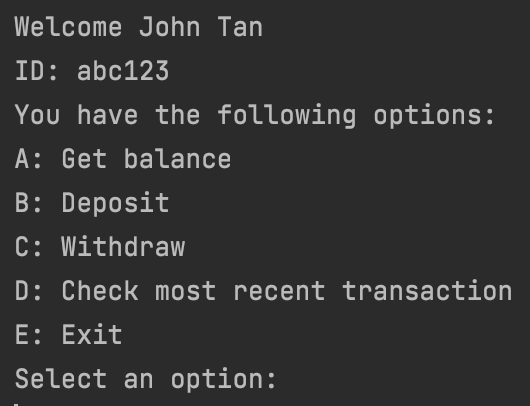
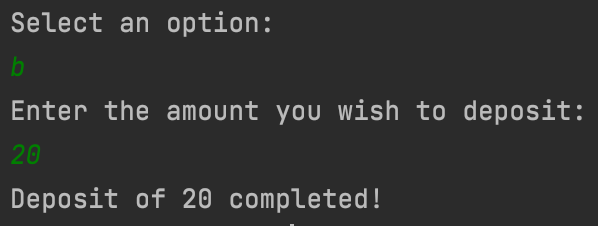
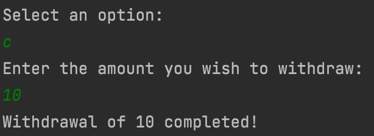
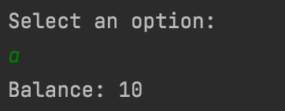
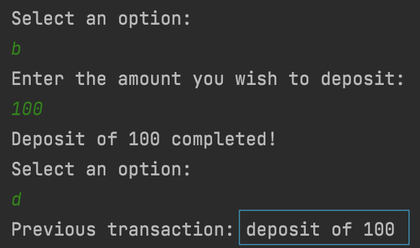
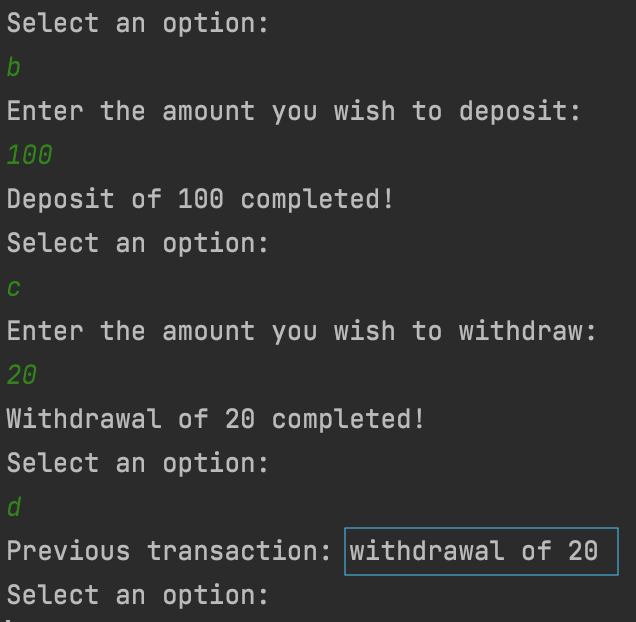
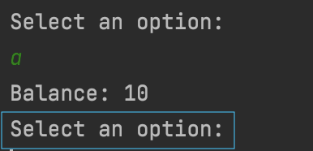
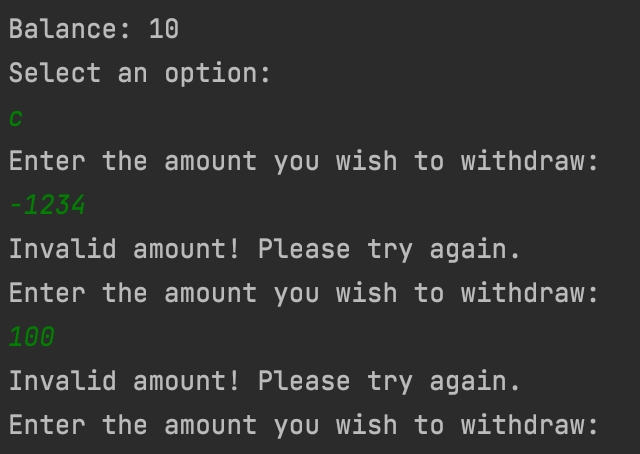
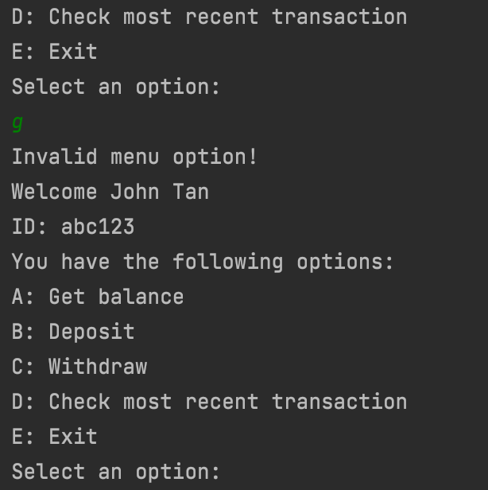
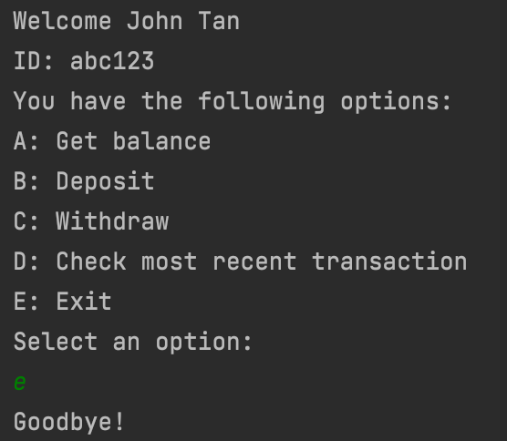

# simple-java-banking-app
Simple Java banking console application developed through Test-Driven Development (TDD). Started as an exploration into TDD, with the aim of practicing and experience development through TDD.

## Prerequisites
- JDK 14.0 and above
- Maven

## Setup
- Clone the repo and run the main function in AccountMenu to begin!
- A default bank account is initialized upon execution, but you can change the input parameters as you like.

## Features

### Main menu selection

### Deposit

### Withdraw

### Display balance

### Display most recent transaction

Deposit:  

Withdrawal:  

### Automatic re-prompt of option selection

### Invalid amount, invalid menu input checking

Invalid amount entered:  

Invalid menu option entered:  

### Terminate at menu

## User stories
* Menu - As a customer, I want to view a menu so that I know what options I have in the app.
* Get account info - As a customer, I want to be able to obtain my account information so that I am aware of my account information.  
* Deposit - As a customer, I want to be able to deposit money in my account so that I can save money.  
* Withdraw - As a customer, I want to be able to withdraw money from my account so that I can have cash to use.  
* Most recent transaction - As a customer, I want to be able to obtain information about my most recent transaction so that I can keep track of my deposits/withdrawals.
* Exit - As a customer, I want to be able to exit so that I can stop the application as and when I would like.
* Re-prompt - As a customer, I want to be able to re-enter my choice so that I can continue using the app if I entered an invalid option.

## Extensions
- Recognizing invalid string input during deposit and withdrawal
- Ability to terminate application during deposit/withdraw/check functions
